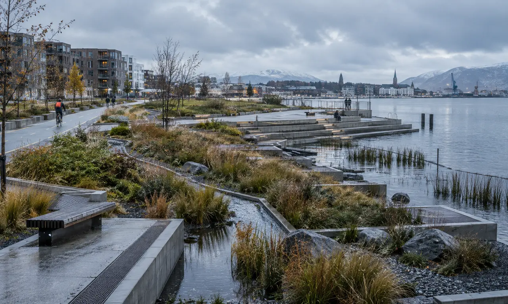

# 冷海筑新：北境转型



一款以哥本哈根与奥斯陆可持续城市实践为背景的 **3–4 人合作式气候治理网页游戏**。

玩家共同组成一座北欧港口城市的转型委员会，在五个年度中建设能源、公共空间、交通、港口和治理项目，应对预算压力，并决定是否动用石油红利来资助绿色未来。

> 五年之内，让承诺真正落地。

## 在线试玩

- **GitHub Pages：** 发布后启用 `https://66hhh.github.io/lenghaizhuxin-game/`
- **原始在线版：** https://leng-hai-zhu-xin-game.hanb51587.chatgpt.site/
- **完全离线版：** 下载 [`assets/leng-hai-offline.html`](./assets/leng-hai-offline.html)，无需联网即可打开

## 游戏概览

| 项目 | 内容 |
|---|---|
| 玩家人数 | 3–4 人，同一台设备轮流操作 |
| 游戏时长 | 约 25–35 分钟 |
| 游戏周期 | 5 个转型年度 |
| 核心指标 | 账面排放、有效排放、公众支持、系统韧性、预算 |
| 深度转型 | 有效排放 ≤ 6、公众支持 ≥ 4、系统韧性 ≥ 5、悖论 ≤ 2 |
| 运行环境 | 现代桌面或移动浏览器，无需后端和数据库 |

## 核心机制

每年依次完成五个阶段：

1. **城市事件**：应对极端降雨、能源价格、港口用电高峰等现实压力。
2. **资金选择**：决定是否接受收益递减的石油红利，同时承担转型悖论。
3. **轮流行动**：玩家使用行动点支持项目、沟通公众、维护系统或刷新市场。
4. **合作落地**：项目获得足够支持后，团队支付预算完成建设。
5. **年度审计**：检查城市指标，并进入下一年度。

四类角色分别关注城市空间、能源水务、港口运营与气候预算。项目之间存在前置条件和协同效应，单项减排并不足以保证城市成功转型。

## 设计主题

游戏将哥本哈根与奥斯陆的城市实践转化为可讨论的公共决策：

- 滨水公共空间如何同时承担日常生活与极端天气适应；
- 区域供热、能源回收和电网扩容如何形成系统能力；
- 港口岸电、电动交通与绿色物流如何避免基础设施错配；
- 气候预算、公开数据和公众参与如何提升治理可信度；
- 当绿色投入依赖化石能源收益时，城市应如何面对转型悖论。

游戏中的城市、项目与数值用于教育和讨论，不代表哥本哈根、奥斯陆或相关机构的官方立场。

## 本地运行与部署

直接下载仓库并打开根目录下的 `index.html` 即可游玩。完整部署说明见 [`部署说明.md`](./部署说明.md)。

项目为纯静态站点，由以下内容组成：

```text
index.html                页面结构
styles.css               页面样式
game.js                  游戏数据与逻辑
sw.js                    离线缓存
manifest.webmanifest     Web App 配置
assets/                  图片、图标、二维码工具与单文件离线版
```

## 反馈

欢迎通过 GitHub Issues 提交：

- 数值平衡与结局体验；
- 规则表述或按钮状态问题；
- 手机端显示和无障碍问题；
- 适合课堂、工作坊或公共讨论的使用建议。

提交试玩反馈时，建议注明玩家人数、最终结局、有效排放、公众支持、系统韧性、悖论数量及最关键的一次决策。

## 权利与使用说明

源代码、文字、视觉素材目前公开用于项目展示、试玩与反馈收集，尚未附加开放源代码许可证。除法律允许的情形外，公开可见不等于授权复制、改编、再发布或商业使用。详见 [`RIGHTS_AND_ATTRIBUTION.md`](./RIGHTS_AND_ATTRIBUTION.md)。

---

## English Summary

**Cold Seas, New Cities: Nordic Transition** is a cooperative climate-governance browser game for 3–4 players. Across five years, players balance emissions, public support, infrastructure resilience and limited budgets while deciding whether oil dividends should finance a greener future.

The game is inspired by sustainable urban practices in Copenhagen and Oslo and is designed for education, workshops and public discussion. The current interface is primarily in Chinese.
